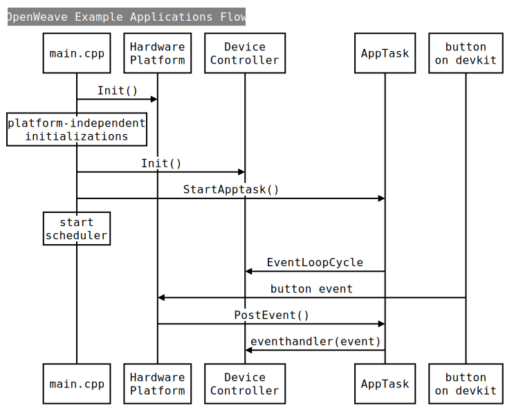

# OpenWeave MFGN Examples

Example applications for MFGN partners showing the use of OpenWeave for
a variety of device types and hardware platforms.

[OpenWeave](https://github.com/openweave/openweave-core/) is the open
source release of Nest's Weave technology, an application layer
framework that provides a secure, reliable communications backbone for
Nest's products.

---

<a name="intro"></a>

## Introduction

The OpenWeave example applications repo currently features two device
types (lock and open/close sensor) on two hardware platforms (Nordic
nRF52840 (nrf5) and Silicon Labs EFR32 MG12/MG21 (efr32)).

The example applications provide working demonstrations of connected
devices built using OpenWeave, OpenThread, and the SDKs of various
hardware platforms.  They are intended to serve both as a means to
explore the workings of OpenWeave and OpenThread, as well as a template
for creating real products. It is important to note that these example
applications are not "production-ready", but efforts are made in the
code to bring attention to areas that developers must pay attention to
for production readiness of their firmware.

The example applications build upon the [OpenWeave][OPENWEAVE] and
[OpenThread][OPENTHREAD] projects, which are incorporated as submodules
and built from source.  A top-level Makefile orchestrates the entire
build process, including building OpenWeave, OpenThread and files from
the SDK of the selected hardware platform.  The resultant image file can
be flashed directly onto the development kit of the hardware platform.

<a name="software-architecture"></a>

## Software architecture


[FIXME: Get a diagram that is application-agnostic]

The examples are built on the Weave application layer framework provided
by [openweave-core][OPENWEAVE].  At the heart of this are the **Weave
Core** components.  These components provide the essential functionality
required to speak Weave.  This includes code for encoding and decoding
Weave messages, communicating Weave messages over various transports
(TCP, UDP, BLE), tracking Weave conversations (exchanges) and
negotiating secure communications.

The **Weave Profiles** sit atop the core components and provide support
for specific types of Weave interactions.  Central among these is the
Weave Data Management profile (**WDM**), which provides a generalized
protocol for communicating state, configuration settings, commands and
events between Weave nodes.  Other profiles support device provisioning
(pairing), OTA software update, time synchronization, and device
identification and control.

The **Weave Device Layer** serves to adapt the portable Weave Core and
Profile components to run in the context of a particular device
platform. For the current examples, device platforms supported are
Nordic's nRF52840 and Silicon Labs EFR32 MG12/MG21.  Additionally, the
Device Layer also provides platform-neutral services (APIs) to the
application for performing certain fundamental operations that are
common to all Weave devices.  These include managing a device's
persistent configuration, managing its network connectivity, scheduling
and orchestrating OTA software updates and others.

The examples make use of various components provided by the hardware
platform SDKs, including BLE support libraries, persistent storage
management, crypto services, logging and others.  The platform's
adaptation of **FreeRTOS** is used to support multi-threading and task
synchronization.

**OpenThread** provides the core Thread stack implementation and manages
persistent storage of Thread network configuration.  The **LwIP**
Lightweight IP stack provides IP services on top of Thread, including
TCP, UDP and ICMPv6.

<a name="directory-structure"></a>

## Directory structure

##### `src/`

All source code is contained in the src/ directory.

Each example application (device-type) has its own directory within the
`examples/` directory. It contains application-specific code with the
following organization:

```
   src/examples/
       [app-1]/
           include/
           platforms/
               [platform-1]/
                 ldscripts/
               [platform-2]/
               ...
           schema/
           traits/
           DeviceController.cpp
           main.cpp
           README.md
           WDMFeature.cpp
           ...
       [app-2]
           ...
```

Directory `common/` contains all code that can be shared among
applications.

```
   src/common/
       include/
       platforms/
           [platform-1]/
               include/
               HardwarePlatform.cpp
               README.md
               ...
           [platform-2]/
               ...
           ...
       AltPrintf.c
       AppSoftwareUpdateManager.cpp
       AppTask.cpp
       Button.cpp
       ConnectivityState.cpp
       CXXExceptionStubs.cpp
       FreeRTOSNewlibLockSupport.c
       LED.cpp
       ...
```

##### `third_party/`

Third-party dependencies are incorporated as submodules and built from
source.

```
    third_party/
        openthread/
        openweave-core/
        printf/
```

<a name="application-components"></a>

## Application components

Here is a high level overview of the processing flow for the example
applications.



#### Core classes

<pre>
src/examples/<b>[device-type]</b>/main.cpp
</pre>

`main.cpp` performs all the initializations for the application:

1. Delegates to HardwarePlatform for all platform-specific
   initializations
1. Performs initializations that are platform-independent
1. Calls DeviceController for all application-specific initializations.

It then calls AppTask to setup and start the FreeRTOS application task.
And finally, it starts the FreeRTOS scheduler.

<pre>
src/common/include/HardwarePlatform.h
src/common/platforms/<b>[platform]</b>/HardwarePlatform.cpp
</pre>

`HardwarePlatform.h` defines the interface that encapsulates all
platform-specific behavior.  Its platform-specific implementation
initializes all the LEDs and Buttons exposed by the development kit, and
handles the proper dispatching of all button events triggered on that
devkit.

<pre>
src/common/include/AppTask.h
src/common/AppTask.cpp
</pre>

`AppTask` sets up and starts the FreeRTOS task that runs the
application's code. AppTask is initialized with a pointer to a function
in the DeviceController that is called at each cycle of its event loop.

<pre>
src/examples/<b>[device-type]</b>/include/DeviceController.h
src/examples/<b>[device-type]</b>/DeviceController.cpp
</pre>

`DeviceController` is the object that controls the overall behavior of
the device.  The application task collaborates with the DeviceController
by calling method EventLoopCycle() on every cycle of its event loop.
This allows the DeviceController to do periodic tasks such as animating
the LEDS, updating the state of a button long press, etc.

<pre>
src/examples/<b>[device-type]</b>/include/WDMFeature.h
src/examples/<b>[device-type]</b>/WDMFeature.cpp
</pre>

`WDMFeature` encapsulates everything that is related to Weave Data Model
(WDM).  [FIXME: Will need help from Jay here. I think we need a document
just to cover what happens in that class.]

#### Support classes with platform dependencies

<pre>
src/common/include/LED.h
src/common/include/PlatformLED.h
src/common/LED.cpp
src/common/platforms/<b>[platform]</b>/<b>[platform]</b>LED.cpp
</pre>

The LED class encapsulates the generic behavior of a LED. Note that all
LED objects are initialized in a platform-specific way in
HardwarePlatform, and are accessible via method GetLEDs().
Platform-specific LED behavior is defined in interface PlatformLED.
Each platform implements a subclass of PlatformLED (e.g. Nrf5LED). LED
is initialized with an instance of PlatformLED to which it delegates all
processing that is platform-specific.

[FIXME: I should be able to get rid of `PlatformLED` by simply having
virtual functions in LED.h. However, previous attempt broke things
(could not pair). Anyway, file an issue to fix that once everything is
stable.]

<pre>
src/common/include/Button.h
src/common/Button.cpp
</pre>

The `Button` class encapsulates the generic behavior of a Button. All
Button objects are initialized in a platform-specific way in
HardwarePlatform, and are accessible via method GetButtons().
HardwarePlatform handles the proper dispatching of all button events
triggered on the platform devkit, which is eventually handled by the
event handler associated with the Button.

#### Support classes without platform dependencies

<pre>
src/common/include/ConnectivityState.h
src/common/ConnectivityState.cpp
</pre>

`ConnectivityState` monitors the provisioning/connectivity state of the
device.  It is initialized with a specific LED, and is called at every
event loop cycle by the DeviceController to check on the current
connectivity state. If the state changes, then it updates accordingly
the lighting pattern of its associated LED.

<pre>
src/common/include/AppSoftwareUpdateManager.h
src/common/AppSoftwareUpdateManager.cpp
</pre>

The `AppSoftwareUpdateManager` class encapsulates behavior associated
with Software Updates.  Note that software updates are currently only
partially supported.

#### WDM schema

<pre>
src/examples/<b>[device-type]</b>/schema
</pre>

The schema directory contains all the helper files for the traits
defined in the device's resource definition. These helper files
are generated via WDLC. Note that they are currently provided and not
generated.

[FIXME: Need to prune our example applications so they only use publicly
available traits, allowing us to: 1) include the resource definition in
the source code, 2) generate the schema files via WDLC.]

#### Device traits: sinks and sources

<pre>
src/examples/<b>[device-type]</b>/traits
</pre>

The traits directory hosts all the "source" and "sink" classes for the
device traits.

[FIXME: See FIXME for WDMFeature. This doc on WDM should include
information about sinks and sources as well.]

NOTE: The DeviceController is the source of truth for the state of the
device.  It relays any state change to the appropriate TraitDataSource
instance which is accessible via WDMFeature.get[trait].  Since the
service proxies the device state, the service requests the information
and eventually is synchronized with the device.

[FIXME: verify that and document that in the source code.]

#### Configuration

<pre>
src/common/include/OpenThreadConfig.h
</pre>

Overrides to default OpenThread configuration.

[FIXME: Split into common and app-specific.]

<pre>
src/common/include/WeaveProjectConfig.h
</pre>

Overrides the default OpenWeave configuration.

[FIXME: Split into common and app-specific.]

<pre>
src/common/platforms/<b>[platform]</b>/include/<b>[filename]</b>.h
</pre>

Overrides the default platform configuration.

For nrf5: `src/common/platforms/nrf5/include/app_config.h`

For efr32: `src/common/platforms/efr32/include/app_config.h`

<pre>
src/examples/[device-type]/platforms/<b>[platform]</b>/ldscripts/<b>[filename]</b>.ld
</pre>

[FIXME: Provide links to docs that describe the content of that file]

## Hardware platforms documentation

* [Nordic nrf5](src/common/platforms/nrf5/README.md)
* [Silicon Labs efr32](src/common/platforms/efr32/README.md)

## Applications documentation

* [Lock](src/examples/lock/README.md)
* [Open/Close Sensor](src/examples/ocsensor/README.md)

[OPENTHREAD]: https://github.com/openthread/openthread
[OPENWEAVE]: https://github.com/openweave/openweave-core
